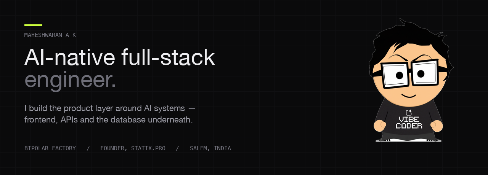

I'm a AI-Native full-stack engineer in Salem, India — **React and TypeScript** on the front,
**FastAPI and Node** behind, **Postgres and MySQL** underneath.

Right now I'm at **Bipolar Factory** building the retail-analytics command center:
the dashboards, APIs and data models that turn what the platform's AI systems
output into footfall heatmaps, demographics and ANPR views operators can act on.
I don't train the models — I build everything around them.

Before that I founded **Statix.pro** and took its products from 0 to 1.

---

### Some numbers

| | |
| :-- | :-- |
| **₹43.4 Cr** | budget processed through a 9-role RBAC approval engine I built, across 1,000+ proposals |
| **330+** | active users in 39 departments, 14+ months continuously in production |
| **100+** | files refactored out of a legacy codebase onto TypeScript and Redux Toolkit |
| **IEEE** | published on AI-driven recruitment matching — [read the paper](https://ieeexplore.ieee.org/document/10127551) |

### Selected work

| | | |
| :-- | :-- | :-- |
| [**maheshwaran-portfolio**](https://github.com/Maheshwaran325/maheshwaran-portfolio) | This site. React 19, TypeScript, Vite, no UI framework | [live](https://maheshwaran325-portfolio.netlify.app/) |
| [**Nebius-Debate-AI**](https://github.com/Maheshwaran325/Nebius-Debate-AI) | Two LLM agents argue a topic to resolution — prompt chaining and function calling over Nebius AI Studio | |
| [**msme-inventory-lite**](https://github.com/Maheshwaran325/msme-inventory-lite) | Offline-tolerant inventory for corner shops. Idempotent CSV upsert by SKU, optimistic concurrency, OpenAPI | |
| [**guidetoprofit**](https://github.com/Maheshwaran325/guidetoprofit) | Guide2Profit — financial modelling SaaS. 5-year forecasts, P&L, break-even, funding estimation | [live](https://cashcompassclient-git-main-maheshwaran325s-projects.vercel.app/) |
| [**Land2Build**](https://github.com/Maheshwaran325/Land2Build) | AI-assisted construction planning — 3D site views in React Three Fiber, Leaflet mapping, offline storage in Dexie | |
| [**bpf-the-ascension**](https://github.com/Maheshwaran325/bpf-the-ascension) | Browser boss-rush game in Phaser 3 and TypeScript. Deterministic scoring, local leaderboard, accessibility toggles | [play](https://bpf-the-ascension.vercel.app) |

The work I'm proudest of — a multi-tenant ERP running finance for a 39-department
institution — is closed-source. It's described in more detail on
[my portfolio](https://maheshwaran325-portfolio.netlify.app/#projects).

### What I reach for

```
frontend    React · Next.js · TypeScript · Redux Toolkit · MUI · Recharts · Streamlit
backend     Node.js · Express · Python · FastAPI · Flask · Django
data        PostgreSQL · MySQL · MongoDB · Supabase · S3 / MinIO
ai          LangChain · LangGraph · LangFuse · HuggingFace · function calling
platform    Vercel · Netlify · GitHub Actions · CI/CD
auth        JWT · OAuth · Auth0 · CASL · RBAC
ai coding   Claude Code · Cursor · OpenCode · Cline · Antigravity · Codex · Gemini CLI
```

The shirt in the banner isn't ironic — I ship with coding agents every day.

### Elsewhere


[Portfolio](https://maheshwaran325-portfolio.netlify.app/) ·
[LinkedIn](https://www.linkedin.com/in/maheshwaranak) ·
[X](https://x.com/gingfreecss325) ·
[maheshwaran325@gmail.com](mailto:maheshwaran325@gmail.com)

---

Most of what I build day to day lives in private repos — the graph below is
the part that shows.
